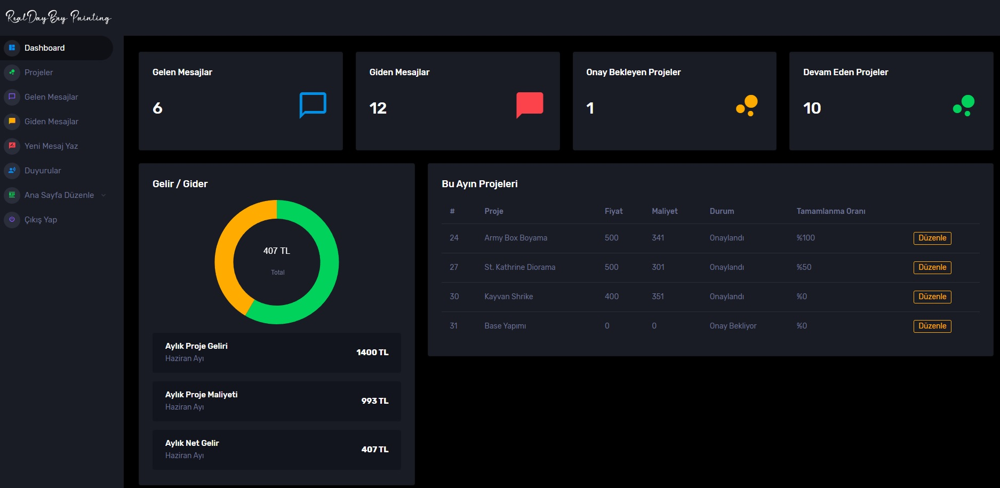
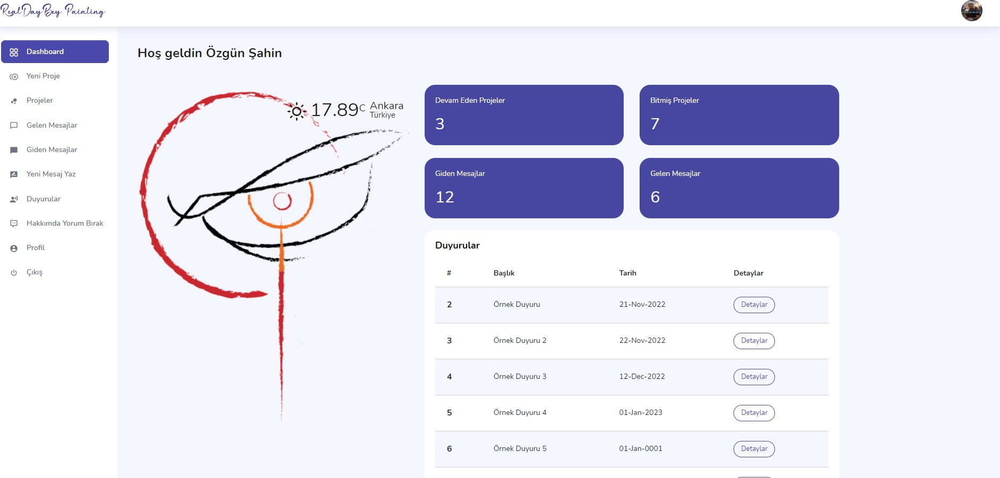

RealDayBey Painting, ASP.NET MVC 5 ile geliştirdiğim kişisel bir Portfolyo uygulamasıdır. 
<h2> 🛠 &nbsp;Kullanılan Teknolojiler ve Projenin Kurulumu</h2>

<table style"float:right;">
  <tr>
    <td></td>
    <td></td>
    <td></td>
    <td></td>
    <td></td>
    <td></td>
    <td></td>
    <td></td>
    <td></td>
  </tr>
</table>

Porjeyi lokalde çalıştırmak için Microsoft Sql Server'ın bilgisayarınızda kurulu olması gerekmektedir.
Projeyi açtıktan sonra Package Manager Console üzerinden önce default proje olarak **DataAccessLayer**'i seçin sonra **update-database** komutunu giriniz.
Bu komut girildikten sonra SQL bağlantısı kurulacak ve bir **Admin** rolüne sahip kullanıcı oluşturulacaktır. 
(Tüm özellikler denenebilmesi için herhangi bir başka örnek veri yoktur. Bu sebeple ilk etapta Ana Sayfadaki değiştirilebilir alanlar boş gelecektir. Admin Panelinden bu kısımları düzenleyebilirsiniz.)
  
#### Admin Kullanıcı Adı: Admin
#### Admin Şifre: Admin060155013!

Proje, Ana sayfa, Admin paneli ve Müşteri paneli olmak üzere üç kısımda incelenebilir.

### 🧑‍🎨 Admin (Portfolyo Sahibi) Rolü
* Ana Sayfayı düzenleyebilir
* Müşterilerle iletişime geçebilir
* Gelen Projeleri onaylayabilir, düzenleyebilir
* Aylık gelir / gider kontrolü
* Duyurular yapabilir
* Müşteri görüşlerinin onayı ve kontrolü

## Admin Paneli

### 👥 Müşteri Rolü
* Admin (Portfolyo Sahibi) ile iletişime geçebilir
* Proje talep edebilir
* Onaylanan Projelerin süreçlerini takip edebilir

## Müşteri Paneli

